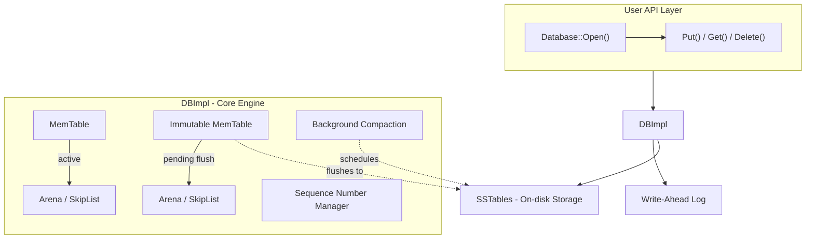
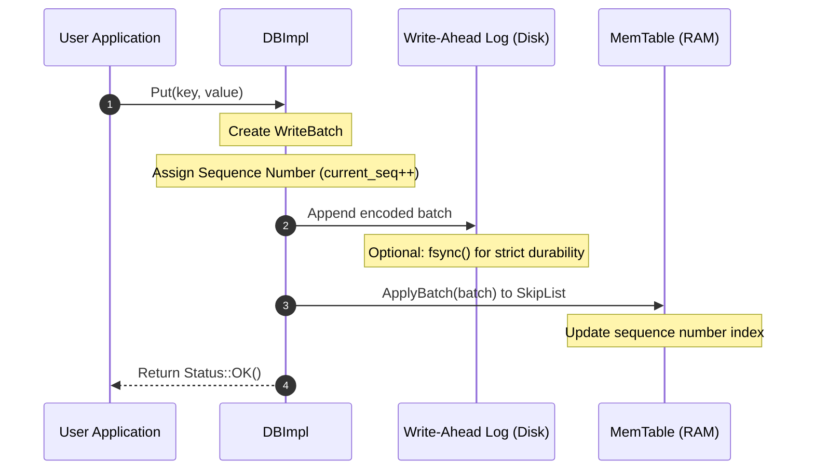
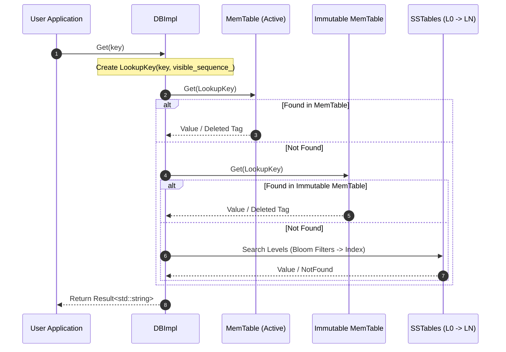
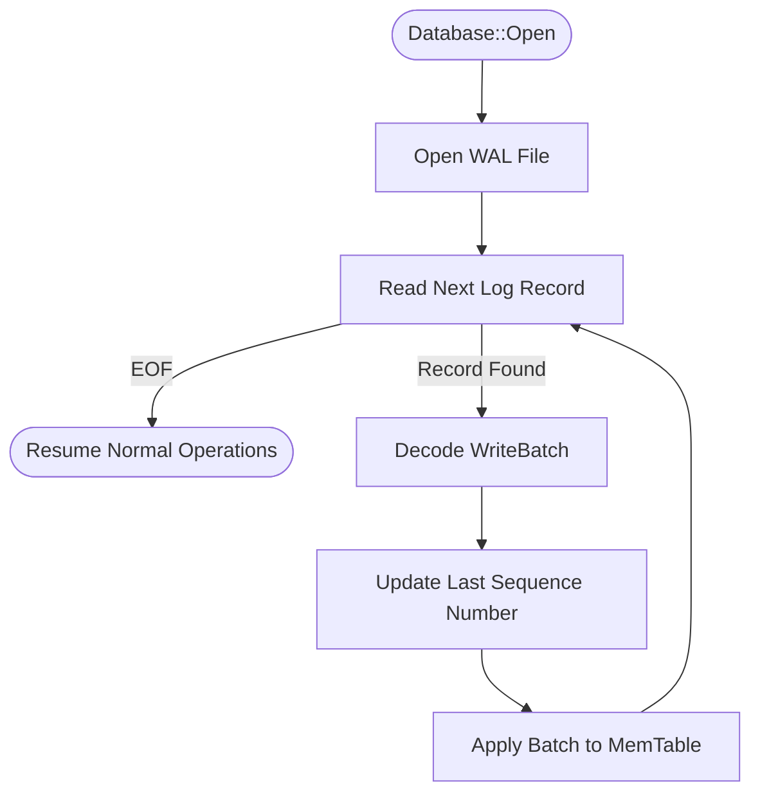
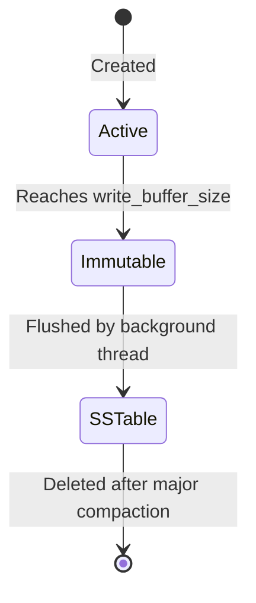
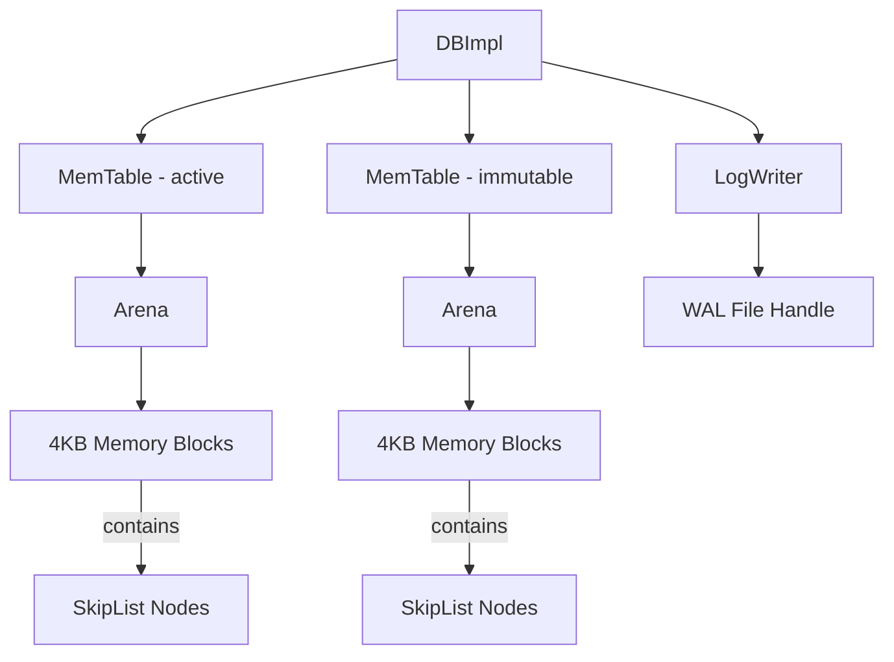
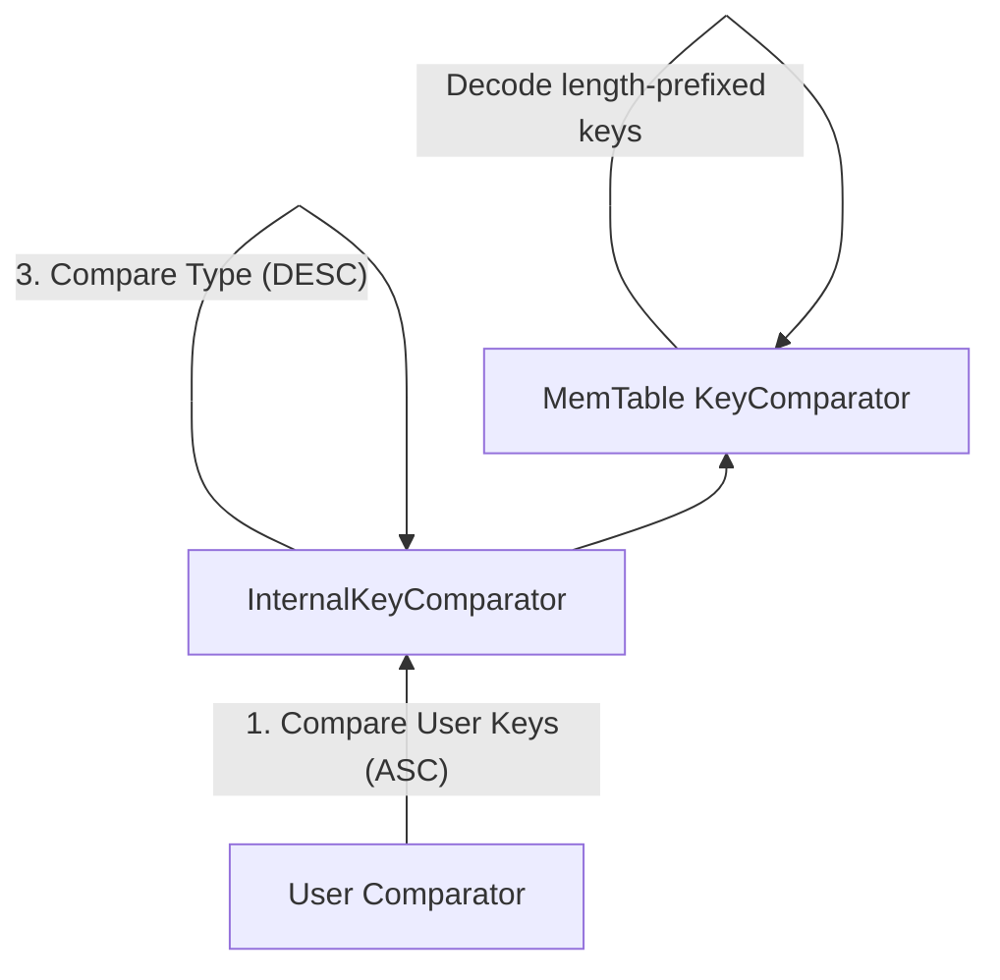

# Prism Architecture Overview

Prism is a high performance key-value store based on the Log-Structured Merge-Tree (LSM-Tree) architecture. It provides atomic batch updates, multi-version concurrency control (MVCC), crash consistency through write-ahead logging, a move-only `Database` sync handle, a coroutine-friendly `AsyncDB` wrapper, and cheap-copy RAII `Snapshot` handles for point-in-time reads. This document outlines the core components, data flow, and design principles of the system.

- **[Compaction Architecture](compaction.md)** - LSM-Tree compaction, background flushes, and metadata authority. Understanding compaction is critical for managing write amplification and read latency.
  - Metadata truth and recovery ordering.
  - Background flush/compaction flows.
  - v1 tombstone policy and deferred backlog.

## System Components

The Prism architecture is divided into three primary layers: the User API, the Core Engine (DBImpl), and the Persistence Layer. The Core Engine coordinates between in-memory structures and on-disk storage to ensure consistency and performance.

### Public API Surface

- `Database::Open(...)` returns the move-only synchronous handle.
- `AsyncDB::OpenAsync(...)` returns an awaitable that yields the async handle.
- `Database::CaptureSnapshot()` and `AsyncDB::CaptureSnapshot()` return a cheap-copy `Snapshot` handle.
- Snapshot reads pass that handle back through the `snapshot_handle` field on `ReadOptions` by value.



---

## Write Path

The write path is designed for high throughput by performing sequential I/O to the Write-Ahead Log (WAL) before updating the in-memory MemTable. This ensures that even if the system crashes immediately after a write, the data can be recovered during the next startup.



**Why this matters:**
- **WAL first**: Ensures durability before in-memory update. If a crash occurs, the WAL is the source of truth for pending writes.
- **Batch atomic**: Multiple operations within a `WriteBatch` commit together. Either all operations are visible, or none are.
- **Sequence number**: Monotonically increasing for MVCC, with a three-way split: `sequence_` (reservation), `versions_->LastSequence()` (persisted), and `visible_sequence_` (publication). Only published writes are visible to readers.
- **Performance**: Writes are never blocked by disk seeks, as the WAL is append-only and the MemTable update is O(log N).

---
---

## Read Path

Prism employs a tiered read strategy, searching from the most recent data (in-memory) to the oldest data (on-disk). This ensures that the most up-to-date version of a key is always returned.



**Why this matters:**
- **Newest first**: Searching MemTable → Immutable MemTable → SSTables ensures version consistency. New versions "shadow" older ones.
- **Short-circuit**: The read returns immediately upon finding a match, minimizing unnecessary disk I/O.
- **Snapshot isolation**: Every read uses either an implicit read sequence or an explicit `Snapshot` supplied through the `snapshot_handle` field on `ReadOptions`, providing a consistent view of the database.
- **Performance Implications**: Frequent reads to keys that don't exist are optimized via Bloom Filters in the SSTables, preventing expensive disk seeks.

## Recovery Path

The recovery process restores the database state by replaying the Write-Ahead Log (WAL) into a new MemTable. This process is triggered automatically during `Database::Open()`.


**Why this matters:**
- **Idempotent**: Replaying the same record multiple times is safe because each operation is tagged with a unique, monotonically increasing sequence number.
- **Sequence tracking**: Prism ensures that the `last_sequence_` after recovery is strictly greater than any sequence number used before the crash.
- **No data loss**: As long as the WAL record was successfully flushed to disk (controlled by `Options::sync`), the write is guaranteed to be recovered.

## Data Structures

### Snapshot Handle

**Purpose:** Preserve a point-in-time read sequence without exposing internal engine ownership.

**Design:**
- `Snapshot` is a cheap-copy RAII handle.
- Callers obtain it from `Database::CaptureSnapshot()` or `AsyncDB::CaptureSnapshot()`.
- Reads use the `snapshot_handle` field on `ReadOptions` by value instead of a borrowed pointer.
- The actual memtable/version pins are taken inside the read path, so the public handle stays lightweight.

### MemTable

**Purpose:** The MemTable serves as the primary in-memory buffer for all incoming writes. It provides sorted storage, which facilitates fast range scans and eventual flushing to sorted SSTables.
**Implementation:**
- **SkipList**: A probabilistic data structure that provides O(log N) search and insertion while being simpler to implement than balanced trees.
- **Arena Allocator**: A custom memory pool that minimizes allocation overhead and improves cache locality by allocating large blocks and using bump-pointers.
- **InternalKey**: Keys are encoded with their sequence number and type (Value/Deletion) to support MVCC. Refer to **[Database Format](dbformat.md)** for encoding details.
**Performance Insights:**
- Writes are O(log N) due to the SkipList structure. Since all memory is allocated from the Arena, there is zero `malloc` overhead on the critical write path.
- Once a MemTable reaches a certain size (e.g., 4MB), it is converted to an **Immutable MemTable** and a new active MemTable is created. This allows background flushing to disk without blocking incoming writes.
**State transitions:**

### SkipList

**Purpose:** Ordered in-memory index

**Properties:**

- Probabilistic balanced tree
- Expected O(log N) search/insert
- No rebalancing needed
- Lock-free reads (with memory barriers)

**Implementation details:**

- Key type: `const char*` (pointer to encoded entry)
- Max height: 12 levels
- Branching factor: 4 (25% probability of next level)
- Memory: Allocated from Arena

### Arena

**Purpose:** Fast memory allocator

**Strategy:**

- Bump-pointer allocation (fast path)
- Block-based (4KB default)
- No individual free (bulk deallocation)

**Usage:**

- MemTable entries (key + value + metadata)
- SkipList nodes (pointers)

**Benefits:**

- Zero malloc overhead for small objects
- Cache-friendly (sequential allocation)
- Fast destruction (free blocks, not objects)

### WriteBatch

**Purpose:** Atomic batch of operations

**Format:**

```
WriteBatch := sequence (8 bytes) | count (4 bytes) | records
Record := kTypeValue key value | kTypeDeletion key
```

**Uses:**

- User API batching
- WAL format
- Replication unit (future Raft integration)

### Log (WAL)

**Purpose:** Write-Ahead Log for durability

**Format:**

```
Block := Record*
Record := checksum | length | type | data
```

**Types:**

- FULL: Complete WriteBatch
- FIRST, MIDDLE, LAST: Fragmented WriteBatch

**Properties:**

- 32KB block size
- CRC32C checksums
- Handles spanning records

---

## Memory Management Hierarchy

Prism uses a hierarchical memory ownership model centered around the `Arena` allocator. This design ensures fast allocation and simplifies object lifetime management by tying the memory's lifecycle to the `MemTable`.

**Why this matters:**
- **MemTable**: Reference counted (`Ref()`/`Unref()`). This is crucial because a MemTable might be accessed by both the foreground write thread and a background flush thread.
- **Arena**: Owned exclusively by its `MemTable`. When the MemTable's reference count reaches zero, the Arena is destroyed, instantly freeing all associated memory blocks without individual `free()` calls.
- **SkipList**: Embedded within the MemTable; its nodes are allocated directly from the Arena.
## Encoding Strategies

### Varint Encoding

**Purpose:** Compact integer representation

**Format:**

- 1 byte if value < 128
- 2 bytes if value < 16384
- Up to 5 bytes for uint32

**Used for:**

- Key lengths
- Value lengths
- Record counts

### Fixed Encoding

**Purpose:** Fast decoding, known size

**Used for:**

- Sequence numbers (8 bytes)
- Tags (8 bytes)
- Checksums (4 bytes)
- Record lengths (2 bytes)

### Length-Prefixed Strings

**Format:** `varint32(len) | bytes[len]`

**Used for:**

- Keys in WriteBatch
- Values in WriteBatch
- Internal keys in MemTable

---

## Comparator Hierarchy
Comparators define the sort order of keys within Prism. Since Prism stores multiple versions of the same user key, the comparison logic must handle both user-defined ordering and internal metadata (sequence numbers).

**Why this matters:**
1. **User Key (ASC)**: Primary sort by the actual key provided by the user. This ensures that the user's data is ordered correctly for range scans.
2. **Sequence Number (DESC)**: Secondary sort. Higher sequence numbers (newer versions) come *before* lower ones. This allows `Seek(user_key)` to land directly on the most recent version.
3. **Value Type (DESC)**: Tertiary sort to handle cases where a key might have both a value and a deletion tombstone at the same sequence (though rare in practice).

## Sequence Number Management

Prism uses a three-way sequence split for correct MVCC visibility:

```plaintext
DBImpl:
  SequenceNumber sequence_ = 1;           // Next sequence to assign (reservation cursor)
  std::atomic<SequenceNumber> visible_sequence_{0};  // Last fully committed + published sequence
  // VersionSet::last_sequence_ persists the last assigned sequence in MANIFEST
  // Invariant: sequence_ == versions_->LastSequence() + 1

Write operation:
  1. Reserve: batch.SetSequence(sequence_); sequence_ += batch.Count()
  2. Persist metadata: versions_->SetLastSequence(sequence_ - 1)
  3. Append batch to WAL
  4. Apply batch to MemTable
  5. Publish: visible_sequence_.store(sequence_ - 1)
     // Readers only see writes after step 5 completes

Read operation (unsnapshotted):
  SequenceNumber snapshot = visible_sequence_.load();
  LookupKey lkey(user_key, snapshot);
  // Sees all committed + published writes

Snapshot read:
  auto snap = db.CaptureSnapshot();       // Freezes current visible_sequence_
  ReadOptions opts;
  opts.snapshot_handle = snap;
  db.Get(opts, key);
  // Sees data at the captured snapshot sequence
```

**Key invariant**: `sequence_` may advance (reserved) before the write is safe to read.
Only after `visible_sequence_` advances are newly written entries visible to unsnapshotted reads.
This prevents readers from observing partially-committed batch writes.

---

## Error Handling

### Status and Result<T>

**Status:** Custom class encapsulating success or an error code with message.

- Used for operations that don't return values
- Examples: Put, Delete, Write
- Error types: NotFound, Corruption, NotSupported, InvalidArgument, IOError
- Check with `s.ok()` or `s.IsNotFound()`, etc.

**Result<T>:** `std::expected<T, Status>`

- Used for operations that return values
- Examples: Get returns `Result<std::string>`

**Error types:**

```cpp
// Status static factory methods:
Status::OK()
Status::NotFound(msg)
Status::Corruption(msg)
Status::NotSupported(msg)
Status::InvalidArgument(msg)
Status::IOError(msg)

// Check for specific errors:
s.ok(), s.IsNotFound(), s.IsCorruption(), s.IsIOError(), etc.
```

**Usage:**

```cpp
// Writing
Status s = db.Put(WriteOptions(), key, value);
if (!s.ok()) {
    // Handle error: s.ToString()
}

// Reading
Result<std::string> result = db.Get(ReadOptions(), key);
if (result.has_value()) {
    std::string value = *result;
} else {
    Status err = result.error();
}
```

---

## Runtime Architecture

Prism's async runtime uses a lane-isolated execution model. Each database instance owns a `RuntimeBundle` that partitions work across dedicated executors to prevent head-of-line blocking between foreground reads and background compaction.

### Physical Thread Layout

Each `RuntimeBundle` manages four physical thread sources:

| Executor | Type | Threads | Purpose |
|----------|------|---------|---------|
| `ThreadPoolScheduler` (shared) | `ThreadPoolScheduler` | N workers | CPU-bound continuations and general dispatch |
| `read_executor` | `BlockingExecutor` | 4 | Foreground async reads and writes |
| `compaction_executor` | `BlockingExecutor` | 1 | Background compaction and flush (single-flight) |
| `serial_lane` | `SerialLane` | 1 worker | FIFO-ordered file writes (Append / Flush / Sync) |

The `ThreadPoolScheduler` is process-wide and shared across all database instances. The other three executors are per-DB and constructed inside `RuntimeBundle`.

### Scheduler Routing

`AsyncOp` routes work through `IScheduler` adapters. There are two primary routing paths:

**AsyncDB operations** (`PutAsync`, `GetAsync`, etc.) use `foreground_db_scheduler`:
```
foreground_db_scheduler.Submit(job)
  -> cpu_executor_impl -> ThreadPoolScheduler (shared CPU pool, worker-local fast path)
```
Work executes on the CPU pool. The completing worker runs the suspend/resume handshake inline and calls `handle.resume()` directly, avoiding a second queue hop.

**AsyncEnv file operations** use `read_scheduler` and `serial_scheduler`:
```
read_scheduler.Submit(job)
  -> read_executor (BlockingExecutor, 4 threads)
  Foreground file I/O: ReadAtAsync, GetFileSizeAsync, etc.

serial_scheduler.Submit(job)
  -> serial_lane (SerialLane, 1 thread)
  FIFO-ordered writes: AppendAsync, FlushAsync, SyncAsync, CloseAsync
```

Compaction does not go through `runtime_scheduler`. The `CompactionController` submits directly to `compaction_executor` so that background merge work never competes with the read lane or CPU pool.

### Why Reads and Compaction Are Isolated

**Before lane isolation**, a single `BlockingExecutor(1)` serialized both reads and compaction. Under read-heavy load the compaction queue could stall behind thousands of read operations, and conversely a long compaction job would block all foreground reads. VTune profiling showed peak queue depths of 23/24 with context-switch counts over 1.1M per benchmark run.

**After lane isolation**:
- Reads scale on a multi-threaded `BlockingExecutor(4)`
- Compaction stays isolated on its own `BlockingExecutor(1)`
- SerialLane guarantees ordered file writes without blocking either lane

**Result**: Throughput on read-heavy workloads improved from 388,990 ops/s to 1,138,247 ops/s (2.93x). Context-switches dropped 87%, and task-clock per run fell 45%. The read lane now peaks at 23/24 utilization without fallback-to-blocking events, while the compaction lane maintains zero queue depth because it runs independently.

### Instrumentation

Opt-in runtime metrics are available by building with `-DPRISM_RUNTIME_METRICS`. When enabled, `RuntimeMetrics` tracks per-lane queue depths, enqueue waits, execution times, and continuation handoff delays. This instrumentation adds roughly 15% overhead and is intended for diagnostic use only.

---

## Component Details

### SSTable (Sorted String Table)

**Purpose:** On-disk sorted key-value storage

**Structure:**

```
SSTable := Data Blocks | Meta Block | Index Block | Footer
```

**Properties:**

- Immutable
- Bloom filter for fast negative lookups
- Binary searchable index
- Compressed (optional)

### Version and VersionSet

**Purpose:** Manage multiple SSTable versions and track metadata changes over time.

**Responsibilities:**

- **Authority**: The sole source of truth for the database's live file set.
- **Manifest**: Persists changes to the version as a log of `VersionEdit` records.
- **Compaction Picker**: Selects levels and key ranges for background compaction.
- **Snapshot Support**: Provides a consistent, immutable `Version` for each read operation.

### Compaction

**Purpose:** Merge MemTable/SSTables, remove old versions, and optimize the LSM-Tree structure.

**Types:**

- **Minor Compaction**: Flushes an immutable MemTable to a Level 0 SSTable.
- **Major Compaction**: Merges files from Level N and overlapping files from Level N+1 into new files in Level N+1.

**Goals:**

- **Space Reclamation**: Snapshot-aware dropping of superseded values and obsolete tombstones during compaction (implemented).
- **Read Optimization**: Maintain the leveled structure to bound read amplification.
- **Write Performance**: Ensure L0 does not accumulate too many files, which could stall writes.

---

## Design Principles

1. **Write-Ahead Logging**: Durability before acknowledgment
2. **Immutability**: SSTables never modified, only created/deleted
3. **LSM-Tree**: Log-Structured Merge tree for write optimization
4. **MVCC**: Multi-version concurrency control via sequence numbers
5. **Zero-copy**: Minimize data copying (Slice, Arena, pointers)
6. **Batch operations**: Amortize costs (WriteBatch, Block writes)
7. **Memory management**: Arena for fast allocation/deallocation

---

## Configuration

```cpp
struct Options {
    // MemTable
    size_t write_buffer_size = 4 * 1024 * 1024;  // 4MB
    
    // File management
    int max_open_files = 1000;
    size_t block_size = 4 * 1024;  // 4KB
    int block_restart_interval = 16;
    size_t max_file_size = 2 * 1024 * 1024;  // 2MB

    // Creation
    bool create_if_missing = false;
    bool error_if_exists = false;

    // Compression
    CompressionType compression = kSnappyCompression;
    int zstd_compression_level = 1;

    // Cache
    Cache* block_cache = nullptr;

    // Filter
    const FilterPolicy* filter_policy = nullptr;

    // Comparator
    const Comparator* comparator = BytewiseComparator();

    // Environment
    Env* env = Env::Default();
};

struct WriteOptions {
    bool sync = false;  // fsync before acknowledging write?
};

struct ReadOptions {
    bool verify_checksums = false;
    bool fill_cache = true;
    std::optional<Snapshot> snapshot_handle;  // Point-in-time read
};
```

Note: This is a simplified overview. See `include/options.h` for the complete definition.
```
