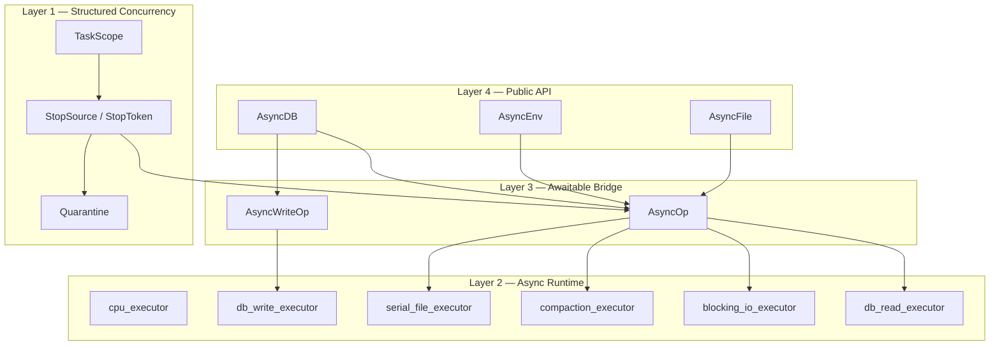
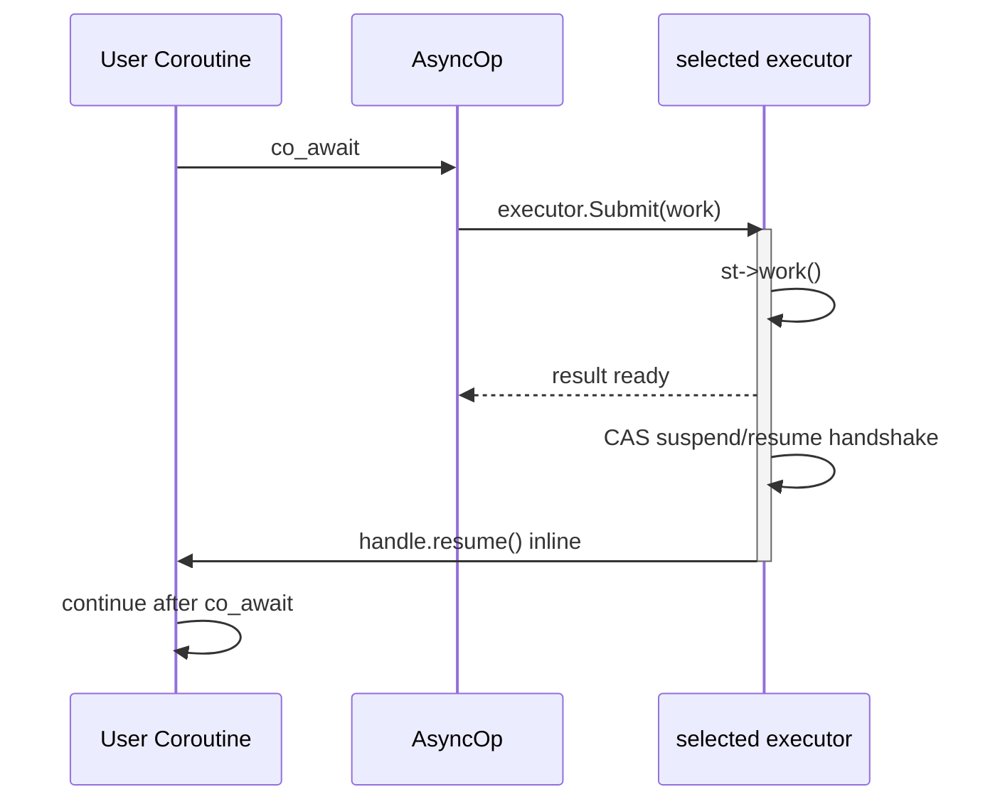
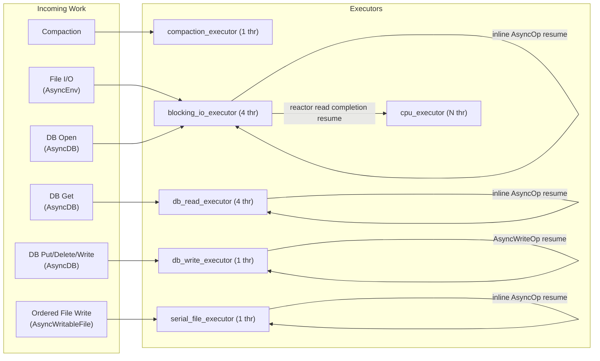
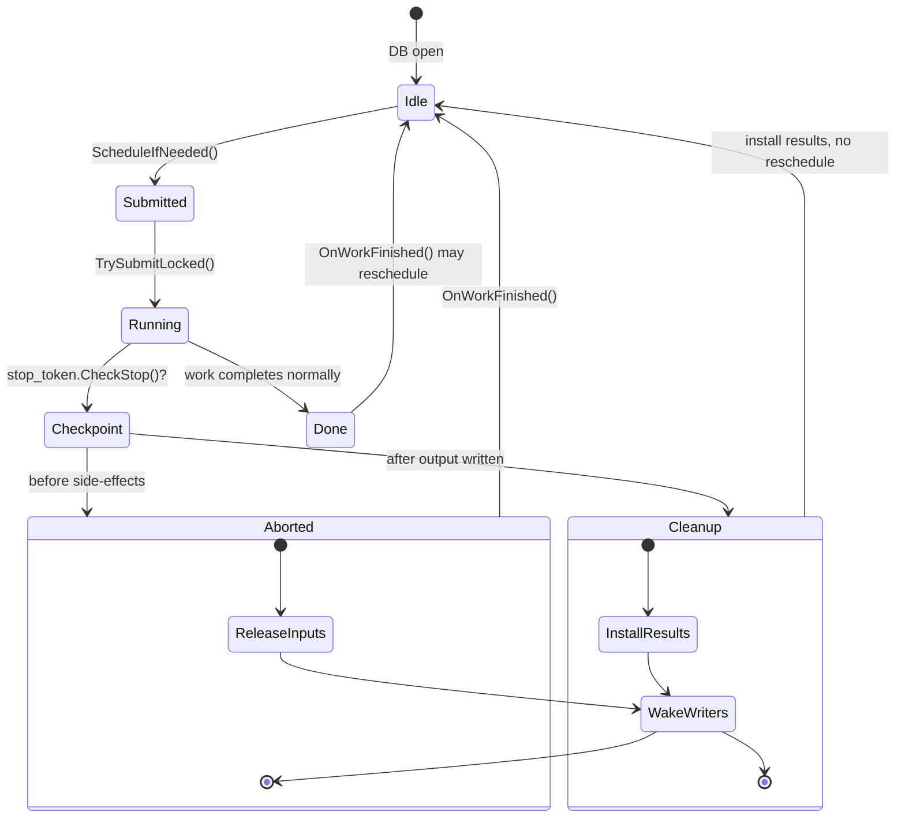
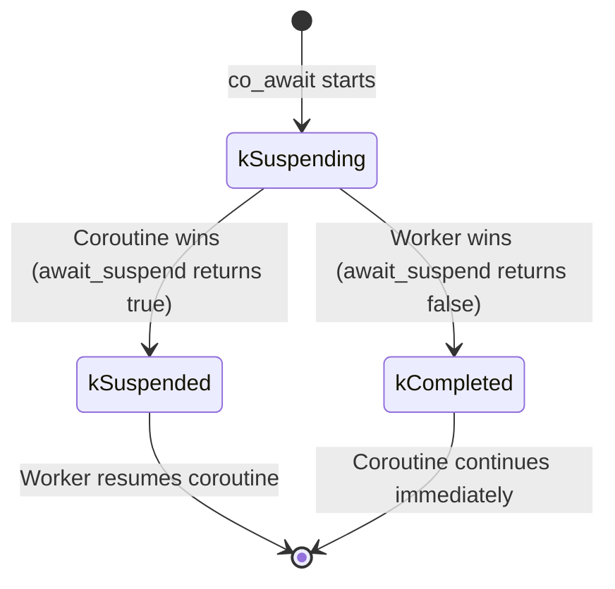

# Coroutine and Async API Design

This document describes Prism's structured concurrency runtime, coroutine integration, and execution model. Prism uses a lane-isolated executor architecture where synchronous DB work, blocking file I/O, CPU continuations, ordered file writes, and background maintenance use distinct execution resources.

## 1. Architectural Layers

```
Layer 1: TaskScope — structured concurrency, stop propagation, join, quarantine
Layer 2: AsyncRuntime — executor dispatch
  |-- CPU Executor (CpuThreadPool — CPU continuations, timers, reactor read resumes)
  |-- DB Read Executor (BlockingExecutor — synchronous DBImpl::Get calls from AsyncDB)
  |-- DB Write Executor (SerialExecutor — WriteCoordinator drain)
  |-- Blocking I/O Executor (BlockingExecutor — file factories, metadata, fallback file I/O)
  |-- Compaction Executor (BlockingExecutor — background compaction/flush)
  |-- Serial Executor (SerialExecutor — FIFO ordered writable files)
Layer 3: AsyncOp — awaitable bridge, suspend/resume handshake
Layer 4: AsyncEnv / AsyncDB — public async API surface
```

### 1.1 Overall Four-Layer Architecture



### 1.2 AsyncOp: Executor-Based Suspend/Resume Handshake



**Current rule**: `include/async_op.h` submits work through the `ExecutorRef` it was given. When that work completes, the worker runs the same three-state suspend/resume handshake inline and calls `handle.resume()` directly if the coroutine is already suspended. Runtime lifetime is explicit: the caller-owned `AsyncRuntime` must outlive async handles and outstanding operations.

### 1.3 Executor Routing: Who Runs What



- **cpu_executor**: CPU-bound continuations, delayed work, affinity APIs, and reactor read coroutine resumes
- **db_read_executor**: `AsyncDB::GetAsync`, because synchronous `DBImpl::Get` can block on table/cache work
- **db_write_executor**: per-DB `WriteCoordinator` drain for `PutAsync`, `DeleteAsync`, `WriteAsync`, and sync `Database::Write`
- **blocking_io_executor**: `AsyncEnv` blocking file I/O and filesystem metadata (ReadAtAsync, GetFileSizeAsync, etc.)
- **compaction_executor**: background compaction/flush work with single-flight control
- **serial_file_executor**: FIFO-ordered `AsyncWritableFile` Append/Flush/Sync/Close

### 1.4 Compaction: Structured Lifetime & Cancellation



**Checkpoint semantics** (phased best-effort):

1. **Pre-start**: stop before picking compaction → no side effects, bail out immediately
2. **Pre-commit**: stop before `LogAndApply()` (manifest install) → release inputs, wake writers
3. **Post-commit**: outputs already on disk → install manifest edits (cleanup), but suppress follow-up scheduling

## 2. Async Runtime and Execution Model

The `AsyncRuntime` is the central runtime container. Callers construct it explicitly from a `CpuThreadPool&`; async handles keep non-owning runtime pointers, so the runtime must outlive those handles and operations.


| Executor            | Type                       | Threads         | Schedules                                                                    |
| ------------------- | -------------------------- | --------------- | ---------------------------------------------------------------------------- |
| `cpu_executor`      | `CpuThreadPool`            | N (caller-owned) | CPU continuations, timers, affinity, reactor read resumes                    |
| `db_read_executor`  | `BlockingExecutor`         | 4               | `AsyncDB::GetAsync` synchronous `DBImpl::Get` work                           |
| `db_write_executor` | `SerialExecutor`           | 1               | Per-DB `WriteCoordinator` drain and grouped WAL commit control               |
| `blocking_io_executor`     | `BlockingExecutor`         | 4               | `AsyncEnv` file I/O — blocking reads and filesystem metadata                 |
| `compaction_executor` | `BlockingExecutor`       | 1               | Background compaction/flush single-flight work                               |
| `serial_file_executor`       | `SerialExecutor`               | 1               | FIFO-ordered `AsyncWritableFile` Append/Flush/Sync/Close                     |

### Why Separate Lanes?

Without separation, a long-running compaction would occupy the same execution lane as foreground reads. The split ensures:

- **Foreground reads never wait behind compaction** — DB reads use their own lane
- **DB writes are serialized deliberately** — `WriteCoordinator` owns grouped write ordering on a single write lane
- **Compaction never blocks foreground progress** — compaction stays isolated on its own lane
- **Single-flight compaction is enforced by `CompactionController`**, not by thread pool availability

### DB Read and Write Lanes

`AsyncDB::GetAsync` wraps work in an `AsyncOp` that receives the `db_read_executor`. At `await_suspend()`:

1. `AsyncOp` calls `db_read_executor.Submit(work)`
2. The dedicated DB read executor runs the synchronous `DBImpl::Get` operation
3. The completing worker runs the CAS handshake inline and calls `st->handle.resume()` directly

`AsyncDB::{PutAsync,DeleteAsync,WriteAsync}` return `AsyncWriteOp` instead of generic `AsyncOp<Status>`. Awaiting an `AsyncWriteOp` enqueues a request into `DBImpl::WriteCoordinator`; the coordinator drains on `db_write_executor`, groups contiguous same-sync requests, writes one merged WAL record, and publishes visibility in order.

This keeps synchronous DB reads and coordinated DB writes off the CPU continuation pool. `AsyncEnv` file I/O operations use `blocking_io_executor` (4 threads), and ordered writable-file operations use `serial_file_executor` (1 thread).

## 3. Core Abstraction: `AsyncOp<T>`

The `AsyncOp<T>` class is the heart of Prism's async design. It is a C++20 awaitable that bridges synchronous work with asynchronous execution.

### Task-Agnostic Design

Unlike many async frameworks, Prism does not force a specific `Task` type on the user. Instead, Prism functions return `AsyncOp<T>`, which can be `co_await`ed in any coroutine that supports the standard C++20 coroutine protocol. This approach has two major benefits:

1. **Zero-Frame Overhead**: `AsyncOp` is not a coroutine function itself (it contains no `co_await` or `co_return`), so it does not create a coroutine frame when called. A frame is only created if the user decides to `co_await` it.
2. **Flexibility**: Users can integrate Prism into their existing coroutine systems (e.g., `asio::awaitable`, `boost::cobalt`, or custom task types).

### The Suspend/Resume Handshake

To prevent a common race condition where a background task completes before the calling coroutine has finished suspending (which would lead to Undefined Behavior), `AsyncOp` implements a three-state atomic handshake.



1. **kSuspending**: The initial state when `await_suspend` is entered.
2. **kSuspended**: The coroutine has successfully suspended. The worker thread is now responsible for calling `resume()`.
3. **kCompleted**: The worker thread finished the task before the coroutine could suspend. In this case, `await_suspend` returns `false`, and the coroutine continues execution on the current thread without actual suspension.

## 4. Async Environment and Files (`AsyncEnv`)

`AsyncEnv` provides async wrappers for filesystem operations. Since coroutines often involve complex lifetime requirements, the async file APIs differ slightly from their synchronous counterparts.

### Buffer Lifetime Rules

In the synchronous `Env` API, `Read` often uses a `Slice*` and a `scratch` buffer. This is dangerous in coroutines because the `scratch` buffer (often on the stack) might be destroyed while the coroutine is suspended.

Prism provides two solutions in `AsyncRandomAccessFile`:

1. **`ReadAtAsync(uint64_t off, std::span<std::byte> dst)`**: A zero-copy API where the caller provides the buffer. The caller **must** ensure the buffer remains valid until the `co_await` completes.
2. **`ReadAtStringAsync(uint64_t off, size_t n)`**: A convenience API that returns an owning `std::string`. This is safer but involves a heap allocation and a copy.

### FIFO Serialization in `AsyncWritableFile`

Database writes (appends to logs or SSTables) must be strictly ordered. `AsyncWritableFile` serializes operations through the `SerialExecutor` executor in `AsyncRuntime`, which provides FIFO-ordered execution on a single dedicated thread. This replaces the earlier ticket/CV scheme, eliminating per-operation worker thread blocking.

## 5. Async Database (`AsyncDB`)

`AsyncDB` is a high-level wrapper around the synchronous `Database` engine. It provides a move-only handle that internally manages shared state for safe async access.

### Lifecycle and Usage

- **Opening**: Use `AsyncDB::OpenAsync(runtime, options, dbname)` which returns an `AsyncOp<Result<AsyncDB>>`.
- **Snapshots**: Call `db.CaptureSnapshot()` to obtain a synchronous RAII `Snapshot` handle declared in `include/snapshot.h`. This handle is cheap to copy and can be passed into `ReadOptions` for async reads.
- **Operations**: `GetAsync`, `PutAsync`, `DeleteAsync`, and `WriteAsync` are the primary entry points.

### Implementation (Offload Model)

- **Runtime dispatch**: `OpenAsync` routes to `blocking_io_executor`; `GetAsync` routes to `db_read_executor`; write methods return `AsyncWriteOp` and enqueue into `WriteCoordinator`. `AsyncEnv` file factory, metadata, and blocking fallback operations route to `blocking_io_executor`. Order-sensitive writable-file operations route to `serial_file_executor`.
- **Structured writes**: The write path is no longer "run one synchronous write lambda on an executor"; it is queueing, grouping, WAL append/sync, and visibility publication under coordinator control.
- **Snapshot Safety**: Since SSTables are immutable and MemTables use sequence-number-based MVCC, a `Snapshot` obtained from the sync engine is safe to use across execution boundaries.

## 6. Migration Guide

Prism now documents only the final by-value handle model: `Database` for sync work, `AsyncDB` for coroutine work, and cheap-copy RAII `Snapshot` values routed through the `snapshot_handle` field on `ReadOptions`.

### Before

```cpp
// Older style: manual-lifetime sync handle plus a separately managed snapshot token.
auto legacy_handle = OpenLegacySyncHandle(options, name);
auto legacy_snapshot = AcquireLegacySnapshot(legacy_handle);

LegacyReadOptions read_options;
read_options.snapshot_handle = legacy_snapshot;
auto value = LegacyRead(legacy_handle, read_options, "k");
ReleaseLegacySnapshot(legacy_handle, legacy_snapshot);
```

### After (sync)

```cpp
auto db_result = prism::Database::Open(options, name);
if (!db_result.has_value()) {
    co_return db_result.error();
}

auto db = std::move(db_result.value());
prism::Snapshot snapshot = db.CaptureSnapshot();

prism::ReadOptions read_options;
read_options.snapshot_handle = snapshot;
auto value = db.Get(read_options, "k");
```

### After (async)

```cpp
prism::CpuThreadPool cpu_pool(8);
prism::AsyncRuntime runtime(cpu_pool);

auto db_result = co_await prism::AsyncDB::OpenAsync(runtime, options, name);
if (!db_result.has_value()) {
    co_return db_result.error();
}

auto db = std::move(db_result.value());
prism::Snapshot snapshot = db.CaptureSnapshot();

prism::ReadOptions read_options;
read_options.snapshot_handle = snapshot;
auto value = co_await db.GetAsync(read_options, "k");
```

## 7. Status and Future Evolution

### Completed

1. **Lane-isolated runtime model** — `db_read_executor` + `db_write_executor` + `blocking_io_executor` + `compaction_executor` + `serial_file_executor`, with CPU continuations kept separate from blocking work
2. **CompactionController** — DB-owned single-flight compaction lane backed by `BlockingExecutor`
3. **TaskScope and structured concurrency** — `StopSource` / `StopToken` (chainable), `Quarantine`, `OperationState<T>` for structured task lifecycle
4. **`Env::Schedule()` / `StartThread()` migration** — DB core no longer uses them; retained as POSIX-background facility in PosixEnv
5. **SerialExecutor migration** — `AsyncWritableFile` now uses `SerialExecutor` executor for FIFO-ordered file writes
6. **Internal cancellation** — `StopSource` propagation through `TaskScope` quarantine and `CompactionController` stop tokens
7. **Backend selection and metrics** — `BackendSelect()` unifies routing; `RuntimeMetrics` provides executor-level counters
8. **io_uring backend** — future work outside the VTune remediation scope; current async reads use executor-lane offload

### Deferred

9. **Public cancellation API**: Expose user-facing `Cancel()` on `AsyncDB` operations.
10. **Full-engine async rewrite**: Core `DBImpl` remains sync; `AsyncDB` is an offload wrapper.
11. **Async Iterators**: Implement `AsyncIterator` to allow non-blocking range scans.
12. **Granular Async (Phase B)**: Modify `AsyncDB` to check MemTable and Immutable MemTable synchronously; only offload disk reads (SSTable) to the blocking executor.
