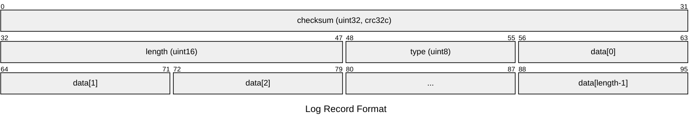

```plaintext
block := record* trailer?
record :=
  checksum: uint32     // crc32c of type and data[] ; little-endian
  length: uint16       // little-endian
  type: uint8          // One of FULL, FIRST, MIDDLE, LAST
  data: uint8[length]
```
