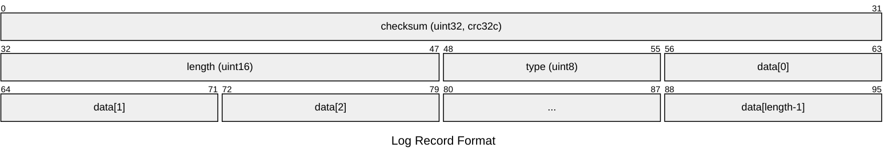

```plaintext
block := record* trailer?
record :=
  checksum: uint32     // crc32c of type and data[] ; little-endian
  length: uint16       // little-endian
  type: uint8          // One of FULL, FIRST, MIDDLE, LAST
  data: uint8[length]
```

## Record Fragmentation

The log format supports fragmentation for records larger than the available space in a block (32KB).

### Record Types

- **FULL (1)**: Complete record fits in one block
- **FIRST (2)**: First fragment of a multi-block record
- **MIDDLE (3)**: Middle fragment of a multi-block record
- **LAST (4)**: Last fragment of a multi-block record
- **ZERO (0)**: Reserved for padding at end of block

### Fragmentation Algorithm

When writing a record:

1. If record fits in current block → write as FULL
2. If record spans blocks:
   - First fragment → FIRST type
   - Middle fragments → MIDDLE type
   - Last fragment → LAST type

### Example: 50KB Record in 32KB Blocks

```plaintext
Block 1 (32KB):
  Header: type=FIRST, length=32753  (32KB - 7 byte header)
  Data: bytes [0..32752]

Block 2 (32KB):
  Header: type=LAST, length=17247   (remaining bytes)
  Data: bytes [32753..49999]
```

### Block Boundary Handling

When less than 7 bytes remain in a block (not enough for header):
- Pad with zero bytes (type=ZERO)
- Start next record in new block

This ensures all records have complete headers.
