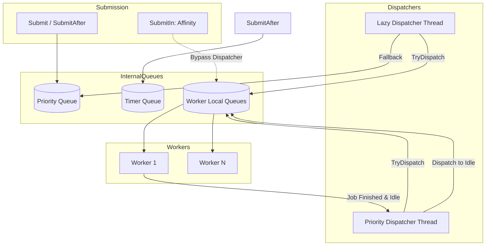

# Thread Pool Scheduler Architecture

This document describes the design and implementation of the `ThreadPoolScheduler`, Prism's CPU continuation executor for short async operations and coroutine resumes.

The `ThreadPoolScheduler` handles **CPU continuations and non-IO work only**. Blocking synchronous operations (such as filesystem I/O, compaction, and long-running sync work) are routed to the `BlockingExecutor` or `SerialLane`. This split prevents blocking work from starving lightweight coroutine continuations.

## 1. Core Abstractions

The system is built around the `IScheduler` interface to allow for dependency injection and deterministic testing.

### `IScheduler`

A minimal abstract interface for work submission:

- `Submit(job, priority)`: Enqueue a job for immediate execution.

### `Job`

A `Job` is a `std::function<void()>`. For coroutines, this typically wraps a `std::coroutine_handle<>::resume()` call.

---

## 2. Architecture Overview

The `ThreadPoolScheduler` uses a **multi-queue dispatch** architecture with dedicated dispatcher threads and worker-local queues.

### Components

1. **ThreadPoolScheduler**: Orchestrates worker threads and dispatchers. Maintains a `pending_list_` of idle workers.
2. **WorkThread**: A pool of $N$ worker threads. Each thread has a private mutex-protected `std::deque` and a `std::counting_semaphore`.
3. **Priority Dispatcher**: Processes a global `priority_queue_` and assigns tasks to idle workers.
4. **Lazy Dispatcher**: Manages delayed tasks in a `lazy_queue_`. It promotes tasks to the priority dispatcher or directly to workers when their deadline expires.

### Dispatch Flow

---

## 3. Task Submission Paths

### `Submit(job, priority)`

Tasks are pushed into a global priority queue. The **Priority Dispatcher** thread monitors this queue. When a task is available and there is an idle worker in the `pending_list_`, the dispatcher assigns the task to that worker's local queue.

### `SubmitAfter(deadline, job)`

Tasks are placed in a global `lazy_queue_` (min-heap ordered by deadline). The **Lazy Dispatcher** thread waits using `try_acquire_until`. Upon expiry, it attempts to find an idle worker via `TryDispatch`. If no workers are idle, the task is moved to the priority queue with maximum priority (`kLazyFallbackPriority`).

### `SubmitIn(context, job)` (Thread Affinity)

Directly pushes a job into a specific worker's local queue, bypassing the global dispatchers. This is used for continuation on the same thread to improve cache locality.

- **Context Capture**: `CaptureContext()` returns an instance-valid `Context` containing the scheduler pointer and worker index.
- **Validation**: If the `Context` is invalid or belongs to a different scheduler instance, the scheduler falls back to a standard `Submit()`. In debug builds, a mismatch trace is emitted.

---

## 4. Task Dispatch & Pending List

To minimize contention on the global priority queue, workers do not "pull" from it. Instead, dispatchers "push" to workers.

- When a worker finishes its current queue and was originally triggered by a dispatcher (marked via `QueuedJob::dispatched`), it re-registers itself in the `pending_list_` and wakes the priority dispatcher.
- This ensures dispatchers only attempt to assign work when a worker is actually ready.

---

## 5. Shutdown & Draining Contract

The scheduler provides a robust shutdown sequence to ensure no tasks are lost, even those submitted re-entrantly during the shutdown process.

### Destruction Sequence

1. **Signal Exit**: `Exit()` sets an `exit_flag_` and wakes all dispatcher and worker threads.
2. **Join Threads**: The scheduler joins the dispatcher threads first, then the worker threads.
3. **Sequential Drain**: Once all threads are joined, the destructor enters a loop to drain any remaining tasks:
  - All pending `SubmitAfter` tasks are promoted and executed.
    - All tasks in the global `priority_queue_` are executed.
    - Each worker's local queue is drained.
4. **Re-entrancy**: Tasks executed during the drain phase are permitted to call `Submit`*. The drain loop continues until the system reaches a steady state (no new tasks generated).

### Preconditions & Guarantees

- **External Submissions**: Calling `Submit`* from a thread *not* managed by the scheduler during its destruction is **unsupported**. In debug builds, this triggers an assertion.
- **Worker Submissions**: Submissions from within a job already running on a worker thread (or during the drain phase) are **supported and guaranteed to be executed**.

---

## 6. Exception Policy

The scheduler enforces a **fail-fast** exception policy:

- Any exception escaping a `Job` is considered a critical programmer error.
- All execution sites (`Consume` loop, `DrainRemaining`, and inline drain paths) are wrapped in `try/catch(...)`.
- If an exception is caught, the scheduler calls `std::terminate()`.

---

## 7. BlockingExecutor and SerialLane

While `ThreadPoolScheduler` owns the CPU continuation pool, Prism's runtime includes two additional specialized executors managed through `RuntimeBundle`:

### BlockingExecutor

The `BlockingExecutor` runs long-running synchronous operations on a dedicated thread. Its primary consumers are:

- **Compaction** — `CompactionController` submits `BackgroundCompaction` work to the `BlockingExecutor` via `BlockingScheduler()`.
- **Blocking file I/O** — reads and writes that cannot use the async `IoReactor` backend.

By isolating these operations from the CPU thread pool, the `BlockingExecutor` ensures that a multi-second compaction never delays a sub-microsecond coroutine resume.

### SerialLane

The `SerialLane` provides strict FIFO ordering on a single dedicated thread. It is used for:

- **Ordered file writes** — `AsyncWritableFile` serializes append/sync operations through `SerialLane`, guaranteeing that writes complete in submission order without ticket-based condition variable overhead.

Unlike the `ThreadPoolScheduler`, `SerialLane` does not support priority dispatch or work-stealing. It is a simple single-threaded queue designed for correctness (ordering) rather than throughput parallelism.

---

## 8. Structured Shutdown with TaskScope

The `ThreadPoolScheduler` participates in Prism's structured concurrency model through `TaskScope`:

- On database destruction, `DBImpl::~DBImpl()` requests compaction stop via `CompactionController::RequestStop()`, waits for the active lane to drain through `background_work_finished_signal_`, and calls `ControllerWaitQuiescent()` to confirm the lane is idle before joining threads.
- `TaskScope` governs short-lived async operations, not database-level background compaction. The compaction controller owns its own stop token and quiescence contract.

This replaces the legacy `Env::Schedule()` / `StartThread()` model, where background work had no structured lifetime guarantees, preventing orphaned compaction from outliving the database.

---

## 9. Implementation Details

- **Memory Management**: The scheduler does not own the data captured in a `Job` lambda. Callers must ensure that any captured pointers or references (e.g., buffers for `ReadAtAsync`) remain valid until the job completes.
- **Worker Count**: By default, the pool size is `max(hardware_concurrency, 2)`.
- **Debug Hardening**:
  - `SubmitIn` validates the scheduler instance to prevent cross-pool affinity corruption.
  - `CaptureContext` uses `thread_local` storage to verify the calling thread belongs to the specific scheduler instance.

