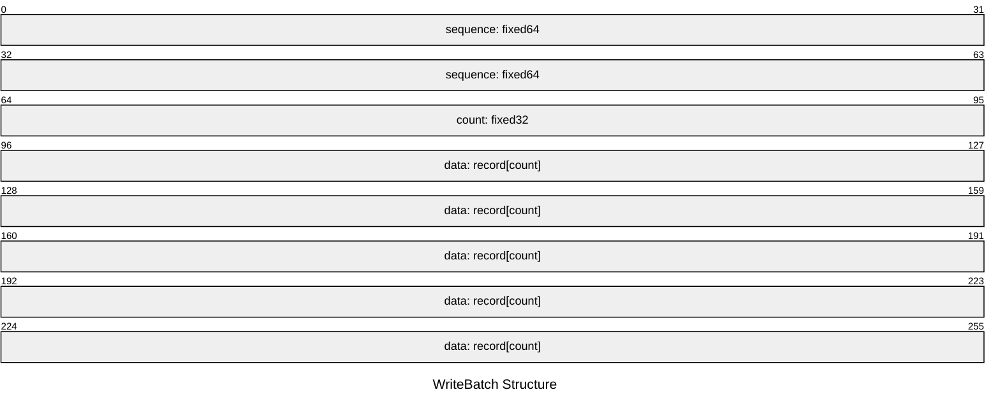
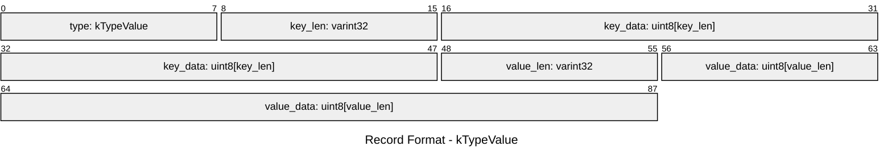
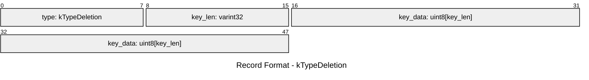

```plaintext
WriteBatch::rep_ :=
   sequence: fixed64
   count: fixed32
   data: record[count]
record :=
   kTypeValue varstring varstring         |
   kTypeDeletion varstring
varstring :=
   len: varint32
   data: uint8[len]
```


`PUT` and `DELETE` have different `record` structure.

We will use `WriteBatch` as the actuall format in our `WAL`.

- `sequence` : 8 bytes, the index of operation
- `count` : 4 bytes, the number of operations
- `record` : the record of `PUT` and `DELETE` opreation
  - kTypeValue varstring(key) varstring(value) (for `PUT`)
  - kTypeDeletion varstring(key) (for `DELETION`)
  - > Here, `varint32` and `uint8[len]` make the `varstring`, which can be understanded as [key_len key_value] or [data_len data_value]
